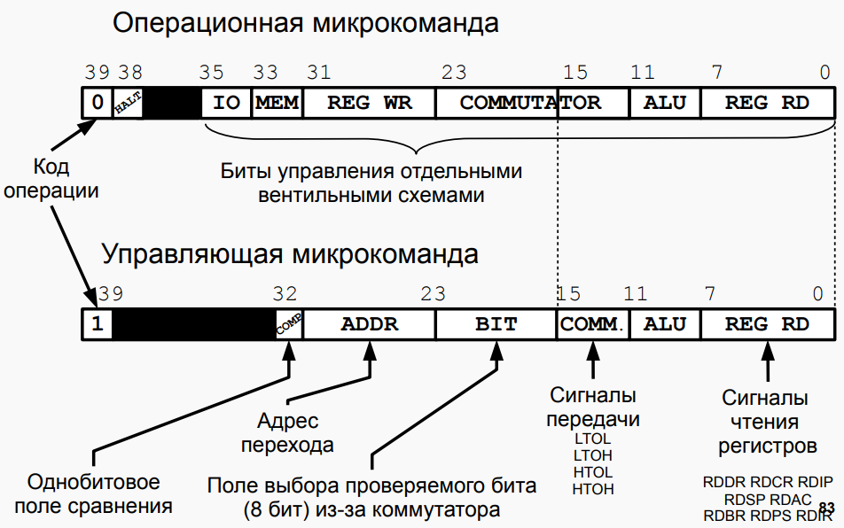

# bcomp-ng-command-maker

Скрипт, составляющий hex-микрокоманды для БЭВМ-NG из мнемоник и удобных чисел.

ВНИМАНИЕ! Скрипт не проверяет почти никакие ошибки. 
Возможные опечатки: несуществующая мнемоника, отсутствие пробела/ключевого слова/неправильный формат введенного числа.
Скрипт может либо крашнуться, либо вообще не дать знать об ошибке.
Сори, у меня не было времени всё предусмотреть (можете кидать PR с фиксами).

### Использование

1. Занести, следуя синтаксису, всё необходимое для команд построчно в файл input.txt
2. Запустить через `python main.py` в консоли или `parse.bat` (на Windows).

### Синтаксис микрокоманд (мнемоники вводятся через пробел):
Операционная: `oper [мнемоники]`

Управляющая:  `control/ctrl {значение COMP 1/0} {hex адрес перехода} {decimal выбранные проверяемые биты (0-7) из коммутатора (через запятую без пробелов)} [мнемоники]`

Дополнительные примочки:

Безусловный переход: `jump {hex адрес перехода}` (эквивалент ctrl 0 ADDR 4 RDPS LTOL)

Скрипт к регистру не чувствителен.

[По всем вопросам.](https://vk.com/notgurev)

### Картиночка из презентации в помощь 

